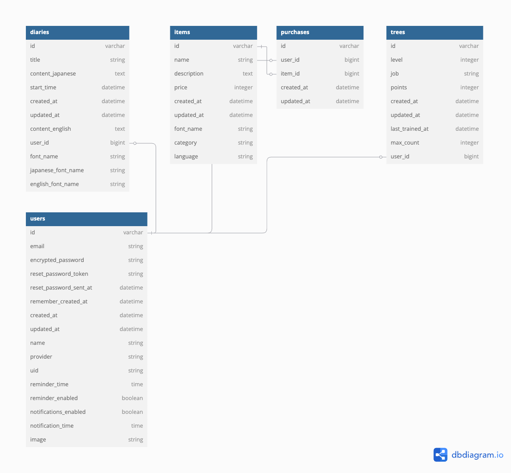

# English Diary
サービスURL:https://englishdiary.jp/

英語日記を習慣化するために日記アプリと育成ゲームをミックスしたアプリです。
このアプリには英語日記の作成を助ける翻訳機能やツリーを育成することでもらえるポイントでフォントと交換できる機能があり、
育成する目的を作ることで、継続力のアップをはかっています。

# 開発背景
私はプログラミングスクールに入学し、プログラミングを学習しました。
その中で、知識を定着させるには、学んだことを記録に残したり、話し合ったりすることが重要であり、アウトプット力が非常に大切であると実感しました。  
また、プログラミングには公式ドキュメントやエラーメッセージの読解など、英語を理解する力が必要な場面が多いと感じました。しかし、当時の私はアウトプット力も英語の読解力も十分ではありませんでした。  
そこで、英語日記を書くことで、この2つのスキルを向上できるのではないかと考えました。
理由として、英語日記はアウトプットの練習として、日常の出来事や自分の気持ちを気軽に書けるため、学習記録よりもハードルが低く、継続しやすいからです。
また、英語で日記を書くことで、英単語の意味を直感的に理解しやすくなり、ボキャブラリーが増えるだけでなく、正しい文法に触れることで読解力も向上すると考えました。  
さらに、英語日記の効果を最大限発揮するには、継続しやすい仕組みが必要だと考えました。そこで、アプリに翻訳機能を追加することで、英語日記作成のハードルを下げ、無理なく続けられるようにしました。  
また、私は過去に「育成ゲーム」に毎日欠かさずログインしていた経験がありました。その経験から、英語日記と育成ゲームの要素を組み合わせることで、楽しみながら継続できるアプリが作れるのではないかと思い、このWebアプリを開発しました。

# 機能紹介
### ユーザー登録
  
「名前」メールアドレス」」「パスワード」「確認用パスワード」を入力してユーザー登録を行います。  
Googleアカウントを使ってユーザーを作成することも可能です。こちらの方がリマインダーメールを確実に受けるとることができるため、おすすめです。  
また、ユーザー登録作成後でもメールアドレスが同じであれば、Googleアカウントと紐づけることも可能です。  

### マイページ
  
トップページではツリーの情報や所持しているフォントを確認することができます。
左側のサイドバーから「日記作成」や「日記一覧」などの各画面に移動することができます。

### 日記作成画面
  
内容（日本語）を入力後「翻訳する」ボタンを押すと、翻訳結果が内容（英語）に出力されます。ただし英語から日本語は対応していません。  
また、翻訳機能を使用しない場合は直接ないよう（英語）に入力することができます。（「翻訳ボタン」を押すと上書きされてしまいます）  
フォント選択から日本語と英語のフォントを購入したフォントにそれぞれ切り替えることができます。  
「日記を作成する」ボタンを押すと日記が保存されます。

###日記詳細画面
  
日記が作成されると日記詳細画面が表示されます。  
その日最初の日記作成だった場合、ツリーに水やりをしたとみなされ、ツリーのレベルが上がります。  
日記詳細画面は日記一覧からも表示することができます。  
「Edit」ボタンを押すと日記を編集することができます。日記作成日時と編集日時がそれぞれ自動で保存されるため、編集を行なっても日記の日付は変わりません。  
「Destroy」ボタンを押すと確認画面が表示され「OK」ボタンを押すと日記の削除ができます。
  
日記を削除すると復元できないため注意が必要です。

### 日記一覧画面
  
カレンダーの中に日記のタイトが表示され、タイトルをクリックすると日記詳細画面を開くことができます。  
当日は赤くハイライトされています。  
タイトル検索を行うことができます。

### ショップ画面
  
購入することができるフォントと価格がが表示されています。  
購入したいフォントの名前をクリックするとフォントの詳細画面に移動します。
  
所持ポイントが足りていると「このアイテムを購入するポイントが不足しています。」が「購入する」ボタンに変わり、購入することができます。

### 設定画面
  
* ユーザー編集

「メールアドレス」に新しいメールアドレス（パスワードのみを変更したい場合は同じメールアドレス）を入力し、新しいパスワードを確認も含め2回入力後、現在のパスワードを入力が完了したら「アカウント更新」ボタンを押すとユーザー情報が更新されます。
* Googleアカウントとの連携設定
  
この画面ではGoogleアカウントとの連携設定が行えます。
連携済みの場合は「Googleアカウントのリンクを解除する」ボタンが表示されます。解除しない場合は押さないように注意してください。
* リマインダー設定

通知を有効にする場合はスライダーをクリックすると緑色になり、通知をする時刻を設定した後、「設定を保存する」ボタンを押すと設定が更新されます。
設定がうまく変更されると「現在の通知ステータス」が緑色で「有効」と表示されます。

# 使用技術
* 認証
  * Devise
  * Google OAuth
* バックエンド
  * Ruby(3.2.2)
  * Ruby on Rails(7.1.2)
* フロントエンド
  * Javascript
* データベース
  * PostgreSQL
* 環境構築
  * Docker
* CI/CD
  * Github Actions
* インフラ
  * Fly.io
  * お名前.com
* その他
  * Google Cloud Translate API
  * simple_calendar
  * sidekiq
  * letter opener web
  * SCSS

# ER図

